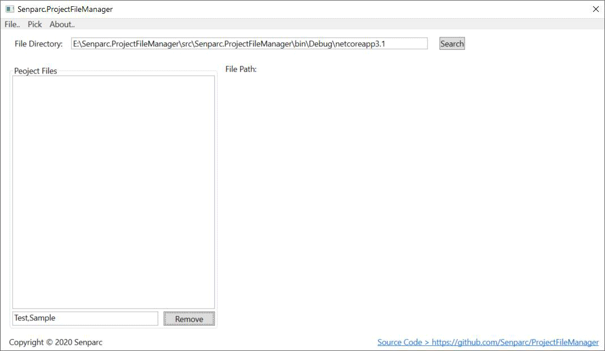

# ProjectFileManager
Senparc.ProjectFileManager can help developers to manage .csproj files under the certain path.

You can use this tool to modify project file information or manage version information individually or in bulk.

## How to use

 

 > If you want to test the project in the example above, you can download the project [here](https://github.com/JeffreySu/WeiXinMPSDK) and specify the directory to [/src](https://github.com/Senparc/ProjectFileManager/tree/master/src).

## Use .exe Application Directly

1. Open [Release Page](https://github.com/Senparc/ProjectFileManager/releases), download the program package from Assets, such as: `Senparc.ProjectFileManager_0.1.0.zip`.

2. Unzip the file and execute `Senparc.ProjectFileManager.exe` file.

## Use Source Code

All the source code is in the [/src](/src) folder, use Visual Studio or Visual Studio Code to open the `Senparc.ProjectFileManager.sln` file. You can modify the code and compile the program by yourself. 

The project is based on .NET Core 3.1 + WPF, so you need to install [.NET Core 3.1 SDK](https://dotnet.microsoft.com/download/dotnet-core/thank-you/sdk-3.1.101-windows-x64-installer) (or higher) before compile the program.

This is also a project where you can learn the .NET Core and WPF program code.

You are welcome to contribute your own code.

## License

Apache License Version 2.0

Detail: https://github.com/Senparc/ProjectFileManager/blob/master/LICENSE
