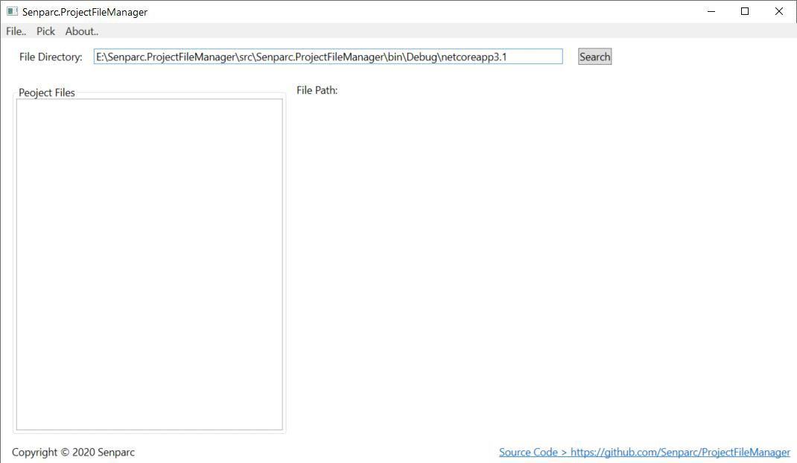

# ProjectFileManager
Senparc.ProjectFileManager can help developers to manage .csproj files under the certain path.

You can use this tool to modify project file information or manage version information individually or in bulk.

## How to use

 

## License
--------------
Apache License Version 2.0

```
Copyright 2019 Jeffrey Su & Suzhou Senparc Network Technology Co.,Ltd.

Licensed under the Apache License, Version 2.0 (the "License"); you may not use this file 
except in compliance with the License. You may obtain a copy of the License at

http://www.apache.org/licenses/LICENSE-2.0

Unless required by applicable law or agreed to in writing, software distributed under the 
License is distributed on an "AS IS" BASIS, WITHOUT WARRANTIES OR CONDITIONS OF ANY KIND, 
either express or implied. See the License for the specific language governing permissions 
and limitations under the License.
```
Detail: https://github.com/Senparc/ProjectFileManager/blob/master/LICENSE
